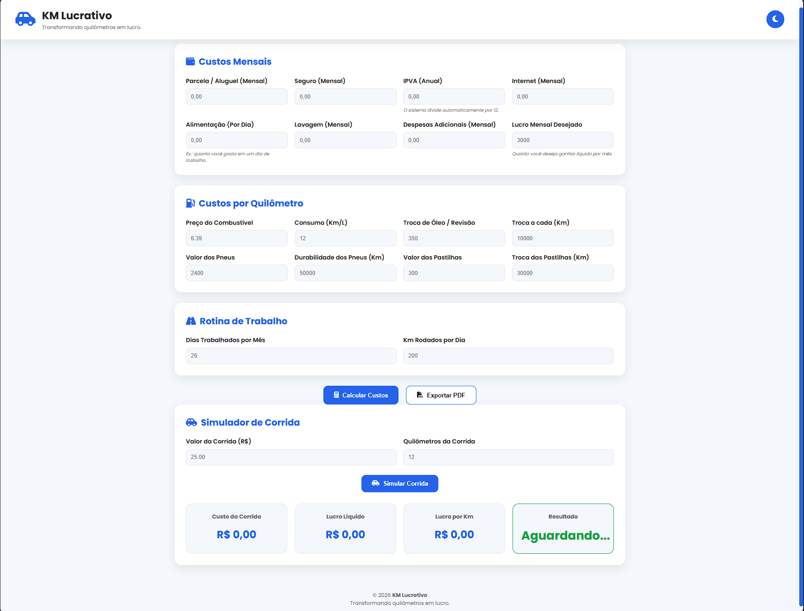
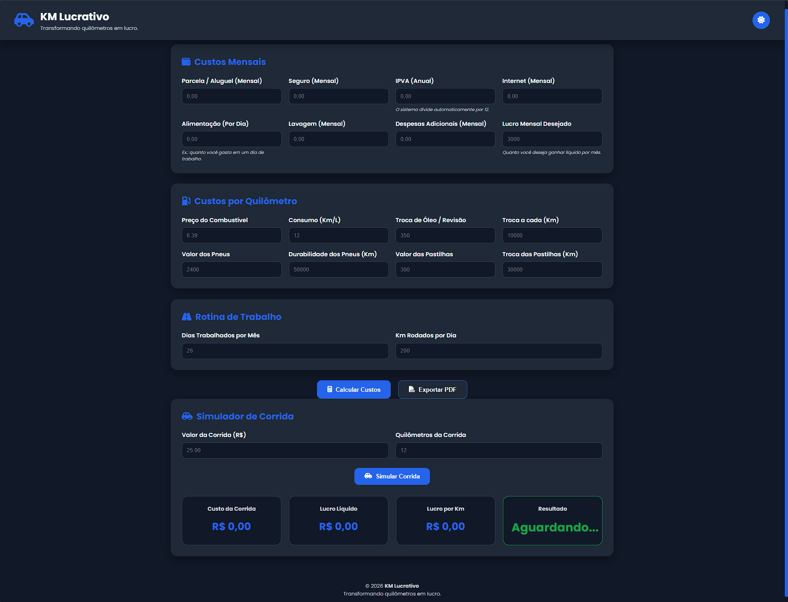
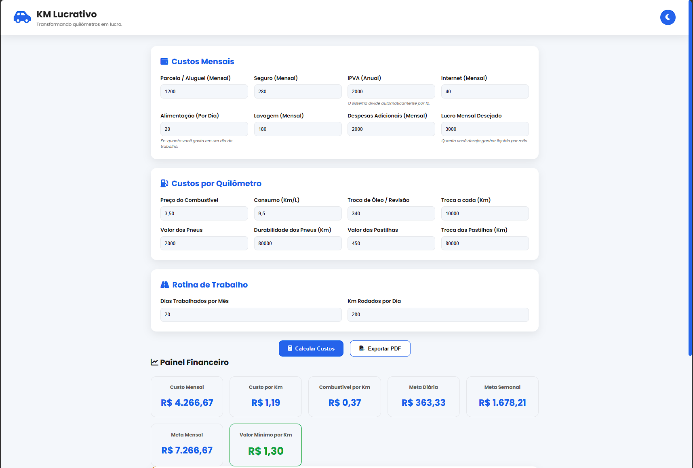
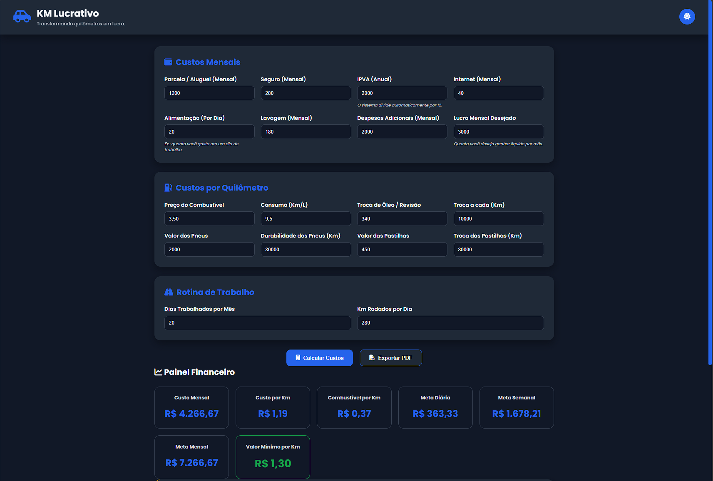
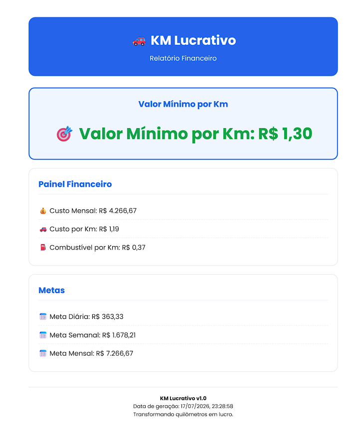

# 🚗 KM Lucrativo v1.0

<p align="center">
  <strong>Transformando quilômetros em lucro.</strong>
</p>

---

## 📖 Sobre o Projeto

O **KM Lucrativo** é uma aplicação web desenvolvida para ajudar motoristas de aplicativo a calcular seus custos reais de operação, descobrir o valor mínimo por quilômetro e analisar se uma corrida realmente gera lucro.

O sistema reúne cálculos financeiros, metas de faturamento, simulador de corridas e geração de relatórios em PDF em uma interface simples, moderna e intuitiva.

---

# ✨ Funcionalidades

- 💰 Cálculo completo dos custos mensais
- ⛽ Cálculo do combustível por quilômetro
- 🛠️ Cálculo dos custos de manutenção
- 📊 Painel Financeiro
- 🎯 Valor Mínimo por Quilômetro
- 📅 Metas diária, semanal e mensal
- 🚕 Simulador de Corridas
- 🧠 Diagnóstico Inteligente
- 🌙 Modo Escuro
- 📄 Exportação de Relatório em PDF

---

# 🛠 Tecnologias Utilizadas

- HTML5
- CSS3
- JavaScript (ES6)
- html2canvas
- jsPDF
- Font Awesome
- Google Fonts (Poppins)

---

# 📸 Imagens do Sistema

## Tela Inicial

Modo Claro

<p align="center">

</p>

Modo Escuro

<p align="center">

</p>

---

## Painel Financeiro

Modo Claro

<p align="center">

</p>

Modo Escuro

<p align="center">

</p>

---

## Diagnóstico Inteligente e Simulador

Modo Claro

<p align="center">

</p>

Modo Escuro

<p align="center">

</p>

---

## Relatório em PDF

<p align="center">

</p>

---

# 🚀 Como utilizar

1. Clone este repositório ou faça o download do projeto em formato ZIP.

```bash
git clone https://github.com/marcelogomesads/KM-Lucrativo

2. Abra o arquivo **index.html** em qualquer navegador.

3. Informe os custos do veículo.

4. Clique em **Calcular Custos**.

5. Utilize o **Simulador de Corridas**.

6. Exporte o relatório em PDF.

---

# 📊 O sistema calcula

- Custos Mensais
- Custos por Quilômetro
- Combustível por Km
- Custos de Manutenção
- Valor Mínimo por Km
- Metas Financeiras
- Lucro por Corrida
- Diagnóstico Inteligente

---

# 📂 Estrutura do Projeto

```text
KM-Lucrativo/
│
├── images/
├── index.html
├── style.css
├── script.js
└── README.md
```

---

# 🔮 Melhorias Futuras

- Histórico de cálculos
- Salvamento automático dos dados
- Dashboard com gráficos
- Comparação entre aplicativos
- Configurações personalizadas
- Relatórios mais completos

---

# 👨‍💻 Autor

**Marcelo**

Projeto desenvolvido durante os estudos de **Análise e Desenvolvimento de Sistemas (ADS)** com foco em praticar HTML, CSS e JavaScript através de uma aplicação voltada para um problema real do dia a dia de motoristas de aplicativo.

---

## ⭐ Gostou do projeto?

Se este projeto foi útil para você, deixe uma ⭐ no repositório.

Isso ajuda a divulgar o projeto e incentiva novas melhorias.
